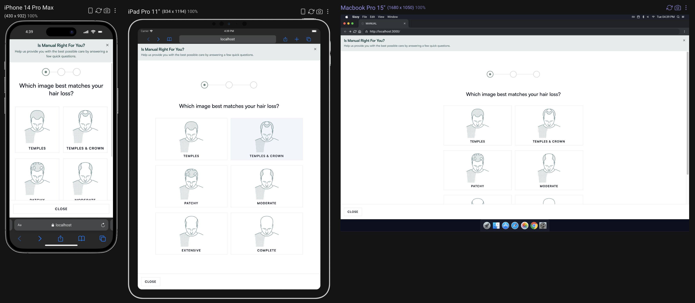

# MANUAL Quiz Landing Page Case Study

This project implements a landing page and quiz user flow.



## Designs

The designs for the mobile and desktop experience are here: https://www.figma.com/design/JfC25Hjs0TfhrhW36kQpfA/MANUAL-Landing-Page?node-id=0-1&t=t61nmefRY10vysI8-1

## Getting Started

First, run the development server:

```bash
pnpm dev
```

Open [http://localhost:3000](http://localhost:3000) with your browser to see the result.

## Testing

We use Playwright for end to end tests. To run the tests headlessly, run ```pnpm e2e```. To run them with a UI, run `pnpm e2e:ui`.
